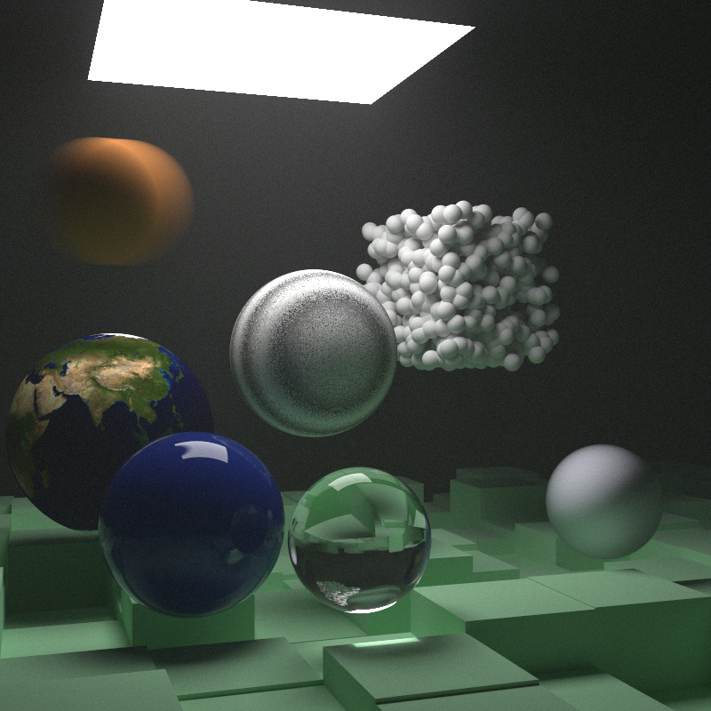
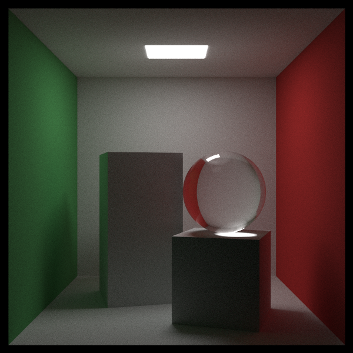
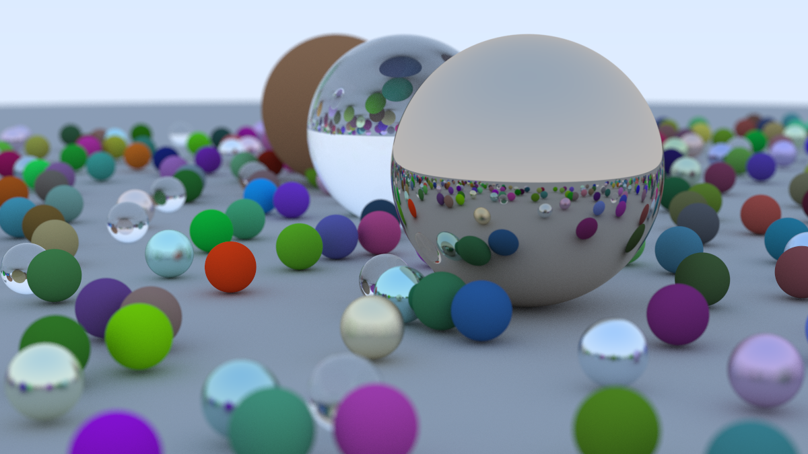

# Monte Carlo Path Tracer (Rust)

A CPU path tracer inspired by the Ray Tracing in One Weekend series. It supports textured materials, Perlin noise, BVH acceleration, volumetrics, area lights, and several showcase scenes.

## Example Renders

Heavy final scene:



Cornell box variant:



Other:



## How to Run

- Prerequisites: Install Rust and Cargo.
- Debug run (faster build, slower render):

```bash
cargo run
```

- Release run (slower build, faster render):

```bash
cargo run --release
```

Notes:
- The program saves the rendered image as `output.png` in the project root and shows a progress bar while rendering.
- The default `main()` renders a high‑quality final scene; it can take a long time.

### Switching Scenes
Edit [src/main.rs](src/main.rs) and change the `match` selector in `main()` to choose a scene:

```
1  => bouncing_spheres
2  => checkered_spheres
3  => earth
4  => solar_system
5  => perlin_spheres
6  => quads
7  => simple_light
8  => cornell_box
9  => cornell_smoke
10 => final_scene(800, 10000, 40)  # high quality
11 => final_scene(400, 250, 4)     # quick preview
```

## Credits

This project is based on the excellent book series:
- Ray Tracing in One Weekend — https://raytracing.github.io/books/RayTracingInOneWeekend.html
