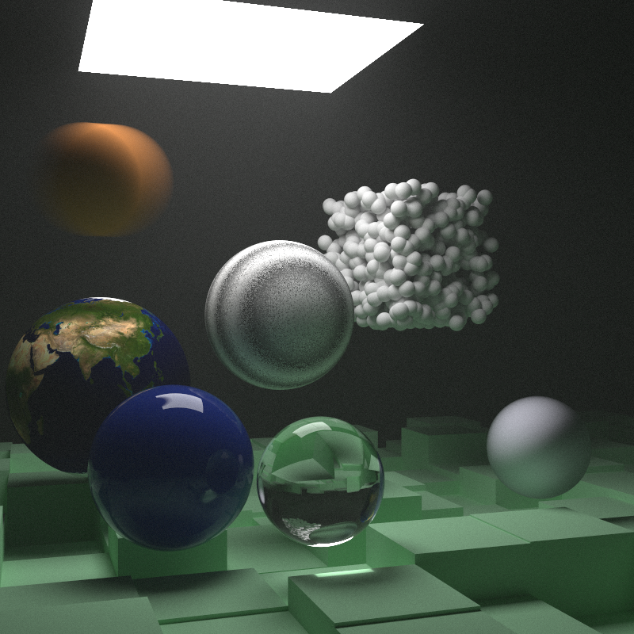

# Monte Carlo Path Tracer (Rust)

CPU Monte Carlo path tracer in Rust inspired by Ray Tracing in One Weekend series.

-- image

## Gallery



## Features

- Geometry: spheres, quads, cuboids, triangles, triangle meshes (PLY loader, ASCII)
- Acceleration: BVH for worlds and meshes; SAH binned builder for meshes
- Materials: Lambertian (textured), metal, dielectric (glass), diffuse lights, isotropic (volumes)
- Textures: solid color, checker, image textures, Perlin noise
- Anti-aliasing: stratified sampling with configurable samples per pixel
- Importance Sampling: cosine-weighted, light-importance, mixture PDFs
- Volumetrics: constant-density media (fog/smoke)
- Camera: depth of field (aperture + focus distance), configurable FOV and orientation
- Parallelism: multi-threaded rendering with Rayon

## Quick Start

- Prerequisites: Rust + Cargo
- Run:

```bash
cargo run --release
or
cargo run -r
```

- Run (show normals):

```bash
cargo run --release --features normals
or
cargo run -r -F normals
```

- Switch scenes: tweak the `match` in [src/main.rs](src/main.rs) to pick a scene.

## Credits

- Inspired by Ray Tracing in One Weekend: https://raytracing.github.io/books/RayTracingInOneWeekend.html
